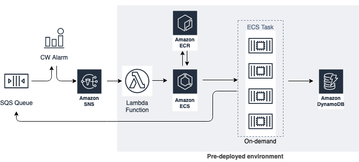

## FastTrack SAA Certification

### SQS & SNS demo

In this demo we will create an environment that will produce messages, store them in an SQS queue, and be processed by a consumer application running on a ECS Service. After being processed by the containerized applicatiion, the messages will be stored in a DynamoDB table plus added metadata.

This is the architecture diagram:



### Pre-requisites

* Docker installed in your client computer
* aws cli installed

> NOTE: We will use *us-east-1* as default region

### In the following steps, you will create the requiered components to make the SQS and SNS demo (this tasks will have to be executedd prior the demo). The components are:

* DynamoDB table
* ECR repo
* Docker image
* ECS Fargate cluster
* Fargate IAM roles
* ECS Task definition
* Lambda IAM role
* ECS Task Security Group
* Lambda function

1. Create DynamoDB table

    ```sh
    aws dynamodb create-table --table-name fasttracksaa --key-schema --attribute-definitions AttributeName=queueMessage,AttributeType=S --key-schema AttributeName=queueMessage,KeyType=HASH --billing-mode PAY_PER_REQUEST
    ```

1. Create ECR repo

    ````sh
    aws ecr create-repository --repository-name fasttracksaa --region us-east-1
    ````

1. Update Python script with env vars

    ````sh
    export awsAccount=`aws sts get-caller-identity --query "Account" --output text`
    envsubst < "pullFromSqsQueue-source.py" > "pullFromSqsQueue.py"
    ````


1. Build the Docker image

    ````sh
    docker build -t sqsdemo .
    ````

1. Add envvars

    ````
    export AWS_DEFAULT_REGION=us-east-1
    export ACCOUNT_NUMBER=`aws sts get-caller-identity --query 'Account' --output text`
    export ECR_REPO_URI=`aws ecr describe-repositories --repository-names fasttracksaa --query 'repositories[*].repositoryUri' --output text`
    ````

1. Authenticate to ECR repo

    ````
    $(aws ecr get-login --registry-ids $ACCOUNT_NUMBER --no-include-email --region us-east-1)
    ````

1. Tag docker image

    ````
    docker tag sqsdemo:latest $ECR_REPO_URI:latest
    ````

1. Push docker image to ECR repo

    ````
    docker push $ECR_REPO_URI:latest
    ````

1. Create ECS Fargate cluster

    ````
    aws ecs create-cluster --cluster-name FastTrack-Saa-Sqs-demo
    ````

1. Create IAM task execution role

    ```sh
    aws iam create-role --role-name fasttrack-saa-taskexecution-role --assume-role-policy-document file://taskexecution-assume-role-policy-doc.json
    export awsAccount=`aws sts get-caller-identity --query "Account" --output text`
    aws iam attach-role-policy --role-name fasttrack-saa-taskexecution-role --policy-arn arn:aws:iam::aws:policy/service-role/AmazonECSTaskExecutionRolePolicy
    ```


1. Create IAM task role

    ```sh
    aws iam create-policy --policy-name fasttrack-saa-task-policy --policy-document file://fasttrack-task-policy-doc.json
    aws iam create-role --role-name fasttrack-saa-task-role --assume-role-policy-document file://taskexecution-assume-role-policy-doc.json
    export awsAccount=`aws sts get-caller-identity --query "Account" --output text`
    aws iam attach-role-policy --role-name fasttrack-saa-task-role --policy-arn arn:aws:iam::$awsAccount:policy/fasttrack-saa-task-policy
    ```

1. Create ECS Task definition

    ```sh
    export awsAccount=`aws sts get-caller-identity --query "Account" --output text`
    envsubst < "container-definitions-source.json" > "container-definitions.json"
    aws ecs register-task-definition --family fasttrack-saa-td --task-role-arn arn:aws:iam::$awsAccount:role/fasttrack-saa-task-role --execution-role-arn arn:aws:iam::$awsAccount:role/fasttrack-saa-taskexecution-role --network-mode awsvpc --container-definitions --cpu 256 --memory 512 --requires-compatibilities FARGATE --container-definitions file://container-definitions.json
    ```

1. Create ECS Task Security Group. NOTE: Update the VPC-Id with the actual VPC you will use for this demo

    ```sh
    aws ec2 create-security-group --group-name fasttrack-saa-ecs-task-sg --description "FastTrack ECS Task security group" --vpc-id vpc-0a899f4ba6ddd6f09
    ```

1. Create Lambda IAM role

    ```sh
    aws iam create-policy --policy-name fasttrack-saa-lambda-policy --policy-document file://fasttrack-lambda-policy-doc.json
    aws iam create-role --role-name fasttrack-saa-lambda-role --assume-role-policy-document file://lambda-assume-role-policy-doc.json
    export awsAccount=`aws sts get-caller-identity --query "Account" --output text`
    aws iam attach-role-policy --role-name fasttrack-saa-lambda-role --policy-arn arn:aws:iam::$awsAccount:policy/fasttrack-saa-lambda-policy
    ```

1. Zip Lambda function python script

    ```sh
    zip -r lambda_ecs_trigger.zip lambda_ecs_trigger.py  -x "*.DS_Store"
    ```

1. Create Lambda function

    > Substitute subnet1, subnet2 and securitygroup with the actual ID's that will be used in this Demo

    ```sh
    export subnet1=subnet-006f5edfd2402c8c2 #[Public subnet 1 ID]
    export subnet2=subnet-07caaadcc30057c84 #[Public subnet 2 ID]
    export securitygroup=sg-0f13d3ef8bbf8ac59 #[Security group ID]
    export awsAccount=`aws sts get-caller-identity --query "Account" --output text`
    envsubst < "lambda-env-vars-source.json" > "lambda-env-vars.json"
    aws lambda create-function --function-name fasttrack-saa --runtime python3.8 --role arn:aws:iam::$awsAccount:role/fasttrack-saa-lambda-role --handler lambda_ecs_trigger.lambda_handler --zip-file fileb://lambda_ecs_trigger.zip --timeout 20 --environment file://lambda-env-vars.json
    ```

1. Add resource based policy for Lambda to be executed by SNS topic

    ```sh
    export awsAccount=`aws sts get-caller-identity --query "Account" --output text`
    aws lambda add-permission --function-name fasttrack-saa --statement-id sns --action lambda:InvokeFunction --source-arn arn:aws:sns:us-east-1:$awsAccount:fasttrack-saa --principal sns.amazonaws.com --source-account $awsAccount
    ```

## Demo time

1. Create an standard SQS queue, **Name: demo-decoupling-saa**, default access policy parameters -> Create queue

1. Create an SNS Topic, **Name: fasttrack-saa**, Stardard topic, leave defaults -> Create topic (you can review the FIFO aand stanadard differences in topics, different types of subscribers, use cases, etc...)

1. Click on **Create subscription**, Protocol: AWS Lambda, Endpoint: [select le lambda function called "fasttrack-saa", you can demo the Lambda function code to show what it does -> pull a message from the queue and put a message in a DynamoDB table, add the container *hostname* as enriched data] -> Create subscription (here's an opprtunity to explain further)

1. Create an alarm to monitor SQS messages in queue and the SNS topic as notification. Go to CloudWatch -> Metrics -> SQS -> Queue metrics. For the queue name: demo-decoupling-saa, select `ApproximateNumberOfMessagesVisible`, click on the tab **Graphed metrics (1)**, change the Statistic to **Sum** and Period to **1 minute**. On Actions click on the little bell to create an alarm. On the alarm setting page, in the **Conditions** section leave default in **Threshold type** and **Whenever ApproximateNumberOfMessagesVisible is...** and for threshold value type **100**. Which mean whenever SQS exceeds 100 messages, the alarm will be triggered. Click **Next**

1. In the next page for Alarm state trigger, leave **In alarm**, in **Select an SNS topic** leave **Select an existing SNS topic**. In **Send a notification to…** search for **fasttrack-saa**. Click on Next.

1. In the **Add name and description** page, type meaningful Name and description. Click **Next**

1. Create Alarm

1. Run a script called `insertToSqs.py` that will insert messages in your SQS queue. [Here's an opportunity to mention the different scenarios and use cases fo SQS and message queues]

    After a minute, this will trigger the CW Alarm -> SNS Topic -> Lambda function -> ECS task workflow, which will eventually put items in your DynamoDB table. You can demo the alarm being triggered, then the ECS tasks being launched and finally the DynamoDB table being updated (you can use "Get live item count" DynamoDB feature). Once the SQS queue is empty, the containers will stop running.